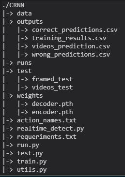

# Introduction

El presente repositorio contiene un modelo diseñado bajo el framework `Pytorch` para la clasificación de videos mediante el análisis de acciones detectadas en un conjunto de frames que son proporcionadas como tensor de entrada `X` al modelo , brindando la posibilidad de realizar de manera sencilla  `entrenamiento`, `evaluación` y `detección en tiempo real` sobre los conjuntos de datos proporcionados.

 
# Description

El modelo **CRNN** (Convolutional Recurrent Neural Network) se encuentra diseñado bajo  una arquitectura de codificador [(CNN)](https://en.wikipedia.org/wiki/Convolutional_neural_network) y decodificador [(LSTM)](https://en.wikipedia.org/wiki/Long_short-term_memory) e implementado utilizando *pytorch*, gracias a esta arquitectura es posible realizar  análisis de múltiples imágenes 2D que de manera continua forman un fragmento que son posteriormente clasificados.

El código para el CRNN se encuentra diseñado para funcionar por defecto con el dataset [UCF101](http://crcv.ucf.edu/data/UCF101.php), por lo cual si se desea realizar un entrenamiento con datos personalizados es necesario pre-procesar los datos anteriormente para contar con la nomezclatura de carpetas que posee este dataset.

Es posible realizar entrenamiento de multiples categorías *From Scratch* o bien de manera *Pre-Entrenada* utilizando los pesos de la arquitectura `ResNet-152` que es utilizada como códificador 

# CRNN Model

Se define `CRNN` como el par de modelos que la conforman Red Neuronal Convolucional quien actuá como el `codificador` y como primer filtro de los datos de entradas, y una Red Neuronal Recursiva quien actuaría como el `decodificar` de las diferentes secuencias de video para generar así la predicción final de salida.

La arquitectura del  `Codificador` consiste en una red [ResNet-152](https://arxiv.org/abs/1512.03385) pre-entrenada utilizada por su eficiencia en la extracción de características, aunque si también es posible modificar esta opción para realizar entrenamiento *From Scratch*. Por otro lado, el `Decodificador` consiste en una red [(LSTM)](https://en.wikipedia.org/wiki/Long_short-term_memory) que permite un análisis efectivo de las secuencias salientes del codificador. 

# Requirements 

El modelo utiliza múltiples librerías y módulos útiles para llevar a cabo la fase de entrenamiento o bien de evaluación. Algunas de estos son `Tensorboard`, `opencv-python,` `ffmpeg` or `tqdm`, es recomendable verificar `requermients.txt` previamente para asegurar que todo los requisitos se encuentren correctamente actualizados a sus versiones correspondientes.
#####
	# Instalar requesitios
	$ pip install -r requermients.txt

**Nota**: En el caso de crear un dataset personalizado, es recomendable la instalación de `ffmpeg` para la limpieza de frames repetidos de los videos para posteriormente convertirlo a conjuntos de imágenes `.jpg` exportando cada frame de manera individual utilizando alguna herramienta como `opencv`

# Instalation

El presente caso de instalación será enfocada para utilizar el dataset ya pre-procesado en imagenes RGB de UCF101, en una futura actualización se expondrá el uso para un conjunto de datos personalizado utilizando el mismo repositorio publicado.

> *Clonar e Instalar*
> 
	  $ git clone https://github.com/valken24/video_analysis
	  $ cd video_analysis
	  $ pip install -r  pip install -r requermients.txt

>  *Descarga UCF101 RGB*

- [**UCF101 RGB - PART 1**](http://ftp.tugraz.at/pub/feichtenhofer/tsfusion/data/ucf101_jpegs_256.zip.001)
- [**UCF101 RGB - PART 2**](http://ftp.tugraz.at/pub/feichtenhofer/tsfusion/data/ucf101_jpegs_256.zip.002)
- [**UCF101 RGB - PART 3**](http://ftp.tugraz.at/pub/feichtenhofer/tsfusion/data/ucf101_jpegs_256.zip.003) 

## Repository Structure

- `data:`  Contenedor por defecto de dataset.
- `outputs:` Contenedor por defecto de resultados de entrenamiento y testing.
- `runs:` Contenedor por defecto de tensorboard en la cual son almacenados los datos del entrenamiento.
- `weights:` Contenedor por defecto de pesos.
- `test:` Carpeta por defecto para testing de detección en tiempo real o de evaluación de modelo.
- `action_names.txt:`Archivo en la cual se deben especificar los nombres de las clases a clasificar (utilizado principalmente en testing).
- `run.py:` archivo principal para la ejecución del modelo.
- `train.py:` código utilizado para la fase de entrenamiento.
- `test.py:` código utilizado para la fase de testing.
- `utils.py:` Funciones adicionales utilizadas por el modelo. 

# Training

Antes de comenzar un entrenamiento, se deben realizar previas modificaciones de acuerdo a la cantidad de categorías o clases correspondientes al propio dataset, en el caso de UCF101 son 101 clases, las que deben ser especificadas en `run.py` en la variable `k = 101`, además de esto, los nombres de cada clase deben ser ingresados en `action_names.txt`.  Una vez realizados los cambios mencionados, para iniciar un entrenamiento se debe realizar por medio de `run.py` especificando una acción además de las parámetros correspondientes.

	usage: run.py [-h] [--data DATA] [--epochs EPOCHS] [--batch_size BATCH_SIZE]
              [--checkpoint CHECKPOINT] [--output OUTPUT] [--n_cpu N_CPU]
              [--encoder_weights ENCODER_WEIGHTS]
              [--decoder_weights DECODER_WEIGHTS] [--cuda] [--tensorboard]
              [--verbose]
              ACTION

- `--data:` parámetro para especificar ubicación del dataset (default: /data)
- `--epochs:` parámetro para indicar número de epochs del entrenamiento (default: 15)
- `--batch_size:` tamaño del lote para el entrenamiento (default: 10)
- `--checkpoint:` parámetro para especificar  carpeta donde se almacenaran los pesos tras el entrenamiento (default: /weights)
- `--output:` parámetro para especificar ubicación donde se almacenaran resultados (default: /outputs)
- `--encoder_weight:` ubicación de los pesos para el `encoder` en caso que se deseen cargar alguno existente.
- `--decoder_weight:` ubicación de los pesos para el `decoder` en caso que se deseen cargar alguno existente.
- `--cuda`: habilitar cuda para entrenamiento o testing, en caso de no existir se utilizará CPU.
- `--tensorboard`: habilitar tensorboard para guardar resultados de entrenamiento
- `--verbose:` ver mediante barra de carga el proceso de entrenamiento o testing. 

**Nota:** El uso de cada uno de estos parametros se encuentra especificado en el mismo archivo `run.py`

El archivo `run.py` cuenta con dos *acciones*, `train` y `test` que deben ser especificados seguido de los parámetros correspondientes:

	> python run.py train --data data --epochs 10 --batch_size 10 --tensorboard --cuda
En caso de utilizar pesos de un entrenamiento anterior:

	> python run.py train --data data --epochs 10 --batch_size 10 --encoder_weights weights/encoder.pth --decoder_weight weights/decoder.pth --tensorboard --cuda

# Testing
El funcionamiento para realizar el testeo del modelo  es muy similar al del entrenamiento, pues tan solo es necesario especificar la función de testing acompañado de los parámetros que se deseen utilizar:
	

    python run.py test --data test/framed_test--batch_size 10 --encoder_weight weights/encoder.pth --decoder_weight weights/decoder.pth --cuda --verbose

